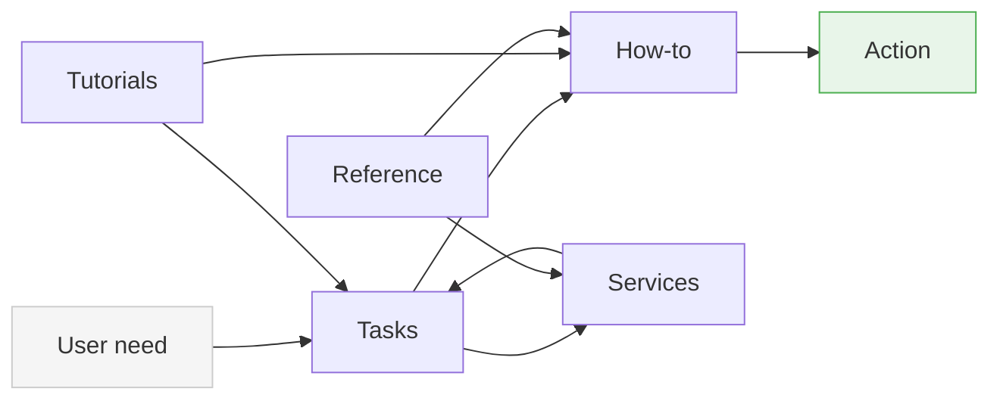

# Contributing to UCT eResearch Documentation

## Purpose of this site

This documentation helps researchers:

- identify what they need to do
- choose the right UCT eResearch service
- take the next step with confidence

The site is designed for **clarity, speed, and execution** — not for teaching or narrative explanation.

---

## Content model (non-negotiable)

All content must fit into one of these layers.

## Content model

This diagram shows how the documentation is structured and how content types relate to each other.



## How to read this

- **Tasks** are the entry point  
  → users start here when they know what they want to do  

- **How-to** provides execution  
  → step-by-step actions  

- **Services** provide capability context  
  → what each system is for  

- **Tutorials** connect steps into workflows  
  → they link to Tasks and How-to  

- **Reference** supports with facts  
  → systems, constraints, terminology  

---

## Key rules

- Tasks route, they do not instruct  
- How-to executes, it does not explain  
- Services describe, they do not guide  
- Reference defines, it does not direct  
- Tutorials connect, they do not duplicate  

---

## What this prevents

- duplication across pages  
- mixing instructions and explanation  
- discipline-specific content leaking into core layers  
- loss of navigational clarity  

---

### Tasks — *what you want to do*

- Entry point for users
- Oriented around intent (e.g. “run analysis”, “store data”)
- Routes to the right service or guide

**Do:**
- describe the goal
- point to next steps

**Do not:**
- include instructions
- explain systems in detail

---

### How-to — *how to do one thing*

- Step-by-step, executable instructions
- One clear outcome per page

**Do:**
- provide exact steps
- assume the user is ready to act

**Do not:**
- include background explanation
- cover multiple workflows

---

### Services — *what a service is for*

- Explains what each service provides
- Helps users decide when to use it

**Do:**
- describe capabilities
- define when to use the service

**Do not:**
- include step-by-step instructions
- duplicate reference or how-to content

---

### Reference — *factual information*

- Stable, factual, lookup content

**Do:**
- describe systems, constraints, terminology
- keep content precise and neutral

**Do not:**
- provide instructions
- guide decisions or workflows

---

### Tutorials — *how steps fit together*

- Show complete workflows across multiple steps
- Link to tasks and how-to guides

**Do:**
- present a real workflow
- connect steps into a sequence

**Do not:**
- include commands or instructions
- teach concepts in depth

---

## Core rules

### 1. No duplication

Content must exist in one place only.

- Tutorials link to Tasks and How-to  
- Tasks link to Services and How-to  
- How-to contains execution  
- Reference contains facts  

If you find yourself repeating content:
→ you are putting it in the wrong place

---

### 2. Maintain boundaries

Each layer has a strict role.

Do not mix:

- instructions into Tasks or Services  
- explanations into How-to  
- workflows into Reference  

---

### 3. Link, don’t copy

Always link to existing pages instead of repeating content.

Example:

→ [Run large-scale analysis](../tasks/run-large-scale-analysis.md)

---

### 4. Use relative links only

All links must be relative.

Do not use absolute URLs for internal content.

---

### 5. Keep content minimal and direct

- Write for action, not explanation  
- Remove unnecessary words  
- Avoid narrative or teaching language  

---

## Writing style

- clear, direct, and neutral  
- no marketing language  
- no unnecessary emphasis  
- no jargon unless required  

Avoid:

- “This guide will help you understand…”  
- “In this tutorial we will explore…”  

Prefer:

- “Use this when…”  
- “Do this to…”  

---

## Tutorials vs training (important)

This site may include tutorials, but it is **not a training platform**.

- Tutorials = workflow composition  
- Training (OER) = conceptual learning  

Do not add:

- lessons  
- exercises  
- long explanations  

---

## Before submitting a change

- check that content fits the correct layer  
- confirm there is no duplication  
- verify all links work  
- ensure `mkdocs build --strict` passes  

---

## Workflow

1. Create a branch  
2. Make changes  
3. Run:

```
mkdocs build --strict
```

4. Open a pull request  
5. Complete the QA checklist  

---

## When in doubt

Ask:

> Is this helping the user act, or explaining something?

- If **act** → How-to or Task  
- If **explain** → it probably does not belong here  

---

## Scope discipline

This site covers:

- research computing (HPC)  
- storage  
- data transfer  
- research software  

Do not expand scope without alignment.

---

## Final principle

This site is a **system**, not a collection of pages.

Every contribution must strengthen:

- clarity  
- structure  
- navigability  