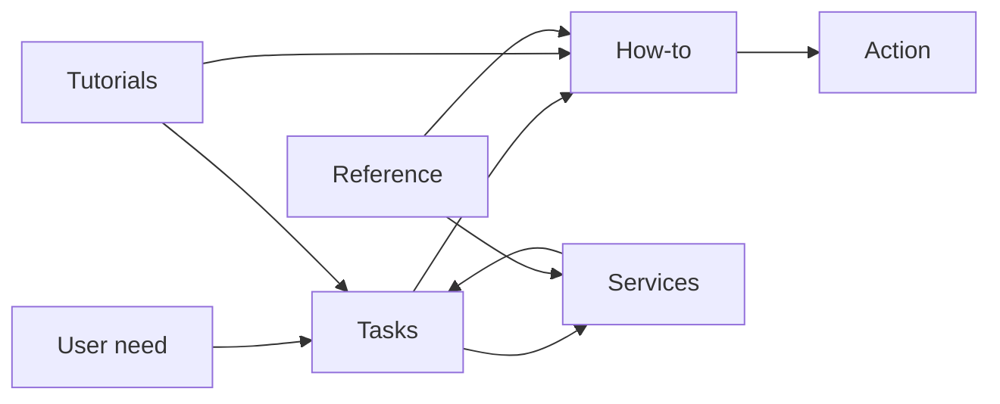

# Contributing to UCT eResearch Documentation

## Purpose of this site

This documentation helps researchers:

- identify what they need to do
- choose the right UCT eResearch service
- take the next step with confidence

The site is designed for **clarity, speed, and execution** — not for teaching or narrative explanation.

---

## Report a problem

If something is unclear, missing, or incorrect:

### 1. Create an issue (preferred)

→ https://github.com/uct-eresearch/eresearch-documentation/issues

- Select the appropriate issue template
- Describe the problem clearly
- Link to the page (if possible)

This is the fastest and preferred way to get issues tracked and fixed.

---

### 2. Submit a fix (advanced)

If you are comfortable using GitHub:

→ follow the contribution workflow below (issue → fork → PR)

---

### 3. Contact eResearch (fallback)

If you cannot use GitHub:

- submit a ServiceNow request  
- or contact the eResearch team  

Requests submitted this way may be converted into GitHub issues for tracking.

---

## Contribution workflow (issue → fork → PR)

All contributions follow this flow:

1. **Open an issue (strongly recommended)**
   - Define the problem or gap
   - Prevent duplication or misplacement

2. **Fork the repository**

3. **Create a branch in your fork**
   ```bash
   git checkout -b fix-<short-description>
   ```

4. **Make your change**
   - Keep it focused (one change per PR)
   - Place content in the correct section

5. **Validate locally**
   ```bash
   mkdocs build --strict
   ```

6. **Push your branch**
   ```bash
   git push origin fix-<short-description>
   ```

7. **Open a Pull Request to `main`**
   - Reference the issue
   - State what changed and why

---

## Example: good issue

**Title:** Fix unclear GPU access requirements

**Description:**
The page `reference/hpc/gpu-access-and-partitions.md` does not clearly state whether users need to request access before submitting GPU jobs.

This creates confusion when following `how-to/hpc/use-gpus.md`.

**Suggested fix:**
Add a short section under “Access conditions” clarifying:
- whether approval is required
- how to request access

---

## Example: good pull request

**Title:** Clarify GPU access requirements in reference page

**What changed:**
- Added a short “Access conditions” section to:
  `reference/hpc/gpu-access-and-partitions.md`

**Why:**
Users could not determine whether GPU access requires approval, causing confusion when using the GPU how-to guide.

**Scope:**
- One reference page updated
- No duplication introduced
- No changes to how-to or tasks

**Linked issue:**
Fixes #123

---

## Content model (non-negotiable)

All content must fit into one of these layers.



---

## Key rules

- Tasks route, they do not instruct  
- How-to executes, it does not explain  
- Services describe, they do not guide  
- Reference defines, it does not direct  
- Tutorials connect, they do not duplicate  

---

## Core rules

### 1. No duplication

Content must exist in one place only.

### 2. Maintain boundaries

Do not mix content types.

### 3. Link, don’t copy

Always link to existing pages.

### 4. Use relative links only

### 5. Keep content minimal and direct

---

## Before submitting a change

- content is in the correct layer  
- no duplication introduced  
- links work  
- `mkdocs build --strict` passes  

---

## Scope discipline

This site covers:

- research computing (HPC)  
- storage  
- data transfer  
- research software  

---

## Final principle

This site is a **system**, not a collection of pages.

Every contribution must strengthen:

- clarity  
- structure  
- navigability  