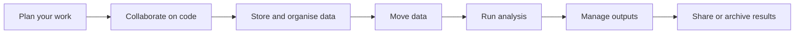

# UCT eResearch Documentation

## Support for your research workflow

Research typically involves a combination of code, data, storage, transfer, and compute.

This documentation helps you move from goal → action using UCT eResearch services.

---

## Research workflow

Each stage connects to one or more services.

---

## Start

- [Start here](start-here/index.md)
- [Tasks](tasks/index.md)
- [Services](services/index.md)

---

## How to use this site

- Start with [Tasks](tasks/index.md) if you know what you want to do  
- Use [Start here](start-here/index.md) if you are unsure  
- Use [Services](services/index.md) to understand available systems  
- Use How-to and Reference for detailed work  

---

## Support

- [Get help](support/index.md)