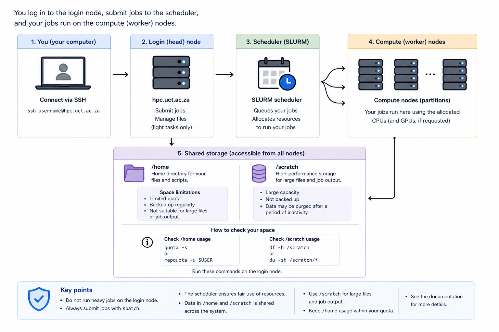

# HPC system overview

This page explains how the UCT High Performance Computing (HPC) system is structured and how jobs run on it.

---

## How the HPC system is structured

The HPC cluster consists of three main components:

### Head node
- The entry point to the cluster  
- Where you log in (`hpc.uct.ac.za`)  
- Used to prepare and submit jobs  

### Worker nodes
- High-performance machines where computations run  
- Provide CPU, memory, and GPU resources  
- Organised into partitions (queues) based on capabilities  

### Shared storage
- Accessible from all nodes  
- Main locations:
  - `/home` → persistent storage  
  - `/scratch` → high-performance working storage  

---

## How jobs actually run

The cluster uses a job scheduler called SLURM (Simple Linux Utility for Resource Management).

- You submit jobs to the scheduler  
- Jobs are placed in a queue  
- Jobs run on worker nodes when resources become available  

This ensures:
- fair sharing between users  
- efficient use of compute resources  
- controlled access to CPUs, memory, and GPUs  

→ Learn more about scheduling behaviour:  
[Scheduler and job submission](../../reference/hpc/scheduler-and-job-submission.md)

---

## Why you must not run jobs on the head node

The head node is a shared system used by all researchers.

- Running compute-intensive commands on the head node:
  - degrades performance for other users  
  - interferes with job scheduling  

Jobs must always be submitted through the scheduler so they run on worker nodes.

---

## Storage model

Storage is shared across the entire cluster:

- Files in `/home` and `/scratch` are:
  - visible on the head node  
  - accessible from all worker nodes  
- Data written during a job is immediately available everywhere  

This shared model enables:
- seamless job execution across nodes  
- consistent access to input and output data  

---

## Partitions (queues)

Worker nodes are grouped into partitions.

- Each partition represents a **queue of resources**  
- Partitions differ in:
  - number of cores  
  - memory  
  - GPU availability  
  - time limits  

When you submit a job, you request resources from a specific partition.

→ View detailed specifications:  
[Cluster specifications](../../reference/hpc/cluster-specifications.md)

---

## Key concepts at a glance

- Log in via the **head node**  
- Submit jobs to the **scheduler (SLURM)**  
- Jobs run on **worker nodes**, not the head node  
- Storage is **shared across all nodes**  
- Resources are accessed through **partitions (queues)**  

---

## Related pages

- **Choosing resources**  
  Understand how to select cores, memory, and time  
  → [Choosing resources](../../good-practice/hpc/choosing-resources.md)

- **Memory and CPU allocation**  
  Learn how memory is assigned and requested  
  → [Memory and CPU allocation](../../reference/hpc/memory-and-cpu-allocation.md)

- **Submit a job**  
  Step-by-step guide to running jobs on the cluster  
  → [Submit a job](../../how-to/hpc/submit-a-job.md)